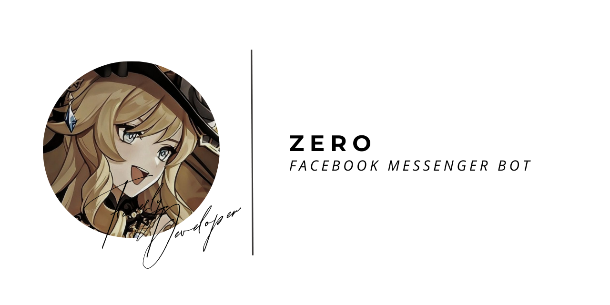

# Zero - Facebook Messenger Chatbot



## About

Zero is an open-source Facebook Messenger chatbot designed to provide a seamless conversational experience for users. Whether you're looking for information, assistance, or just want to engage in casual conversation, Zero is here to help. The bot is built on the principles of simplicity, efficiency, and customization, making it a versatile solution for various use cases.

## Features

- **Conversational Interface:** Zero engages users in natural language conversations, making interactions intuitive and user-friendly.
  
- **Customization:** The bot is easily customizable to suit different purposes and industries. Developers can extend its functionality to meet specific requirements.
  
- **GPL License (Version 3.0):** Zero is released under the GNU General Public License (GPL) version 3.0, ensuring that the source code is open, accessible, and can be freely modified and distributed.
  
- **Multi-functional:** Zero can be configured to handle a wide range of tasks, from providing information and answering queries to executing specific actions based on user inputs.

## Getting Started

### Some Names

- `Thread` is the chat ID.
- `Admin` is the ID of user.
- `Appstate` is the cookie of the facebook account.

### Prerequisites

- Node.js v16
- npm (Node Package Manager)
- Facebook Account

### Installation

1. Clone the repository:

    ```bash
    git clone https://github.com/FireFlyDeveloper/Zero.git
    ```

2. Install dependencies:

    ```bash
    cd zero-chatbot
    npm install
    ```

3. Configure your Facebook App credentials and other settings in the `config.js` file.

4. Start the bot:

    ```bash
    npm start
    ```

5. Set up your Facebook Account token and place it in `appstate.json` file.
    - To get appstate follow this [instruction](https://github.com/c3cbot/c3c-fbstate.git).

**Note: Use a dummy Facebook account for development purposes to avoid the risk of the account being banned due to automated interactions with the Messenger API.**

## License

This project is licensed under the GNU General Public License (GPL) - see the [LICENSE](LICENSE) file for details.

## Contribution

Contributions are welcome! If you have ideas for improvement, bug fixes, or new features, feel free to open an issue or submit a pull request.

